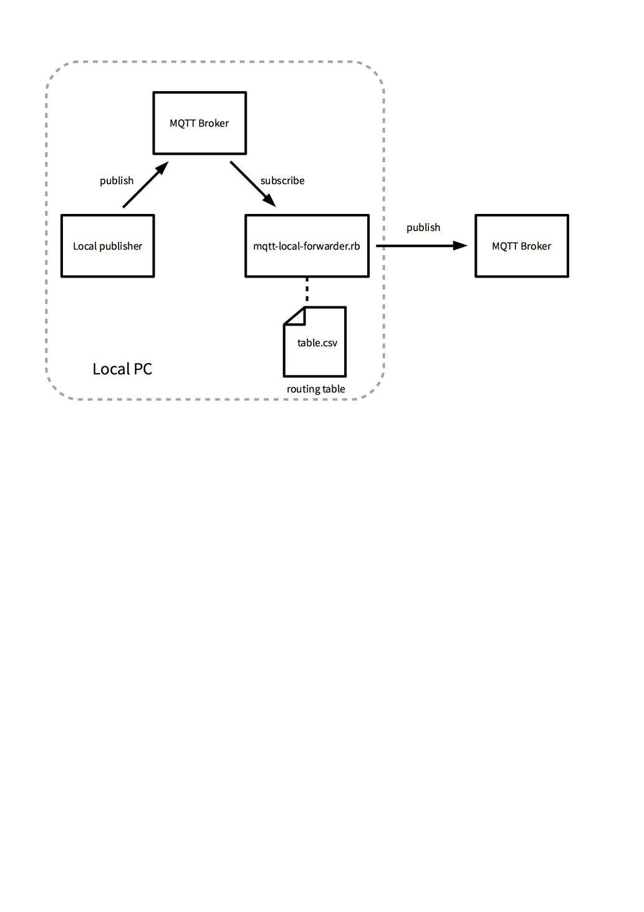

mqtt-local-forwarder.rb
====
* 

How to use
----

    $ mkdir -p ~/work
    $ cd ~/work
    $ git clone https://github.com/yoggy/mqtt-local-forwarder.git
    $ cd mqtt-local-forwarder.rb
    $ cp config.yaml.sample config.yaml
    
    $ vi config.yaml

      # edit host, port, username, password,...etc
    
    $ cp table.csv.sample table.csv
    $ vi table.csv

      # edit subscribe_topic, publish_topic...
    
    $ ./mqtt-local-forwarder.rb

Copyright and license
----
Copyright (c) 2018 yoggy

Released under the [MIT license](LICENSE.txt)
